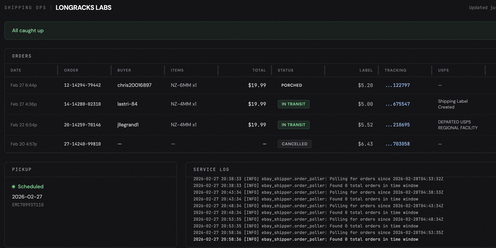

# eBay Shipping Ops

Zero-touch fulfillment automation for eBay sellers. Detects new sales, buys USPS shipping labels, prints packing lists and labels to a thermal printer, uploads tracking to eBay, and schedules USPS pickups.

## What it does

1. **Polls eBay** for new orders every 5 minutes
2. **Buys a USPS label** via EasyPost
3. **Prints packing list + label** to a Rollo thermal printer
4. **Uploads tracking** to eBay (order marked as shipped)
5. **Schedules USPS pickup** on demand

If label purchase fails, an error label prints on the Rollo and the order is saved for retry.

## Dashboard

A web dashboard at `http://shipping-ops.local:8080` tracks orders through fulfillment states that eBay doesn't:

**Printed** → **Packed** → **Pickup Scheduled** → *In Transit* → *Delivered*

The italic states update automatically via EasyPost tracking. Mobile-friendly card layout for checking status from your phone.



## Setup

```bash
python -m venv .venv && source .venv/bin/activate
pip install -e ".[dev]"
cp .env.example .env  # fill in your keys
```

### Required environment variables

| Variable | What |
|----------|------|
| `EBAY_CLIENT_ID` | eBay app client ID |
| `EBAY_CLIENT_SECRET` | eBay app client secret |
| `EBAY_REFRESH_TOKEN` | OAuth2 refresh token (via `get_token.py`) |
| `EASYPOST_API_KEY` | EasyPost API key (test keys start with `EZTK`) |
| `FROM_NAME` | Sender name |
| `FROM_COMPANY` | Company name (optional) |
| `FROM_STREET` | Sender street address |
| `FROM_CITY` | Sender city |
| `FROM_STATE` | Sender state |
| `FROM_ZIP` | Sender ZIP |
| `PRINTER_NAME` | CUPS printer name (default: `Label_Printer`) |
| `POLL_INTERVAL` | Seconds between polls (default: `300`) |

## Usage

```bash
# Run the service (polls for new orders)
ebay-shipper

# Reprint packing list + label for an order
ebay-shipper confirm <order_id>

# Retry a failed label purchase
ebay-shipper retry <order_id>

# Schedule USPS pickup
ebay-shipper pickup [order_id]

# Start the dashboard
ebay-shipper dashboard
```

## SKU Config

Product weights and parcel dimensions are configured in `~/.ebay-shipper/sku_config.json`. Without this file, defaults are used (nozzles: 3oz in 9x6x1 envelope, bundles: 9oz).

```json
{
    "NZ-BNDL": {"weight_oz": 9},
    "NZ-":     {"weight_oz": 3},
    "SPOOL-":  {"weight_oz": 48, "parcel": {"length": 14, "width": 14, "height": 14}}
}
```

- Keys are SKU prefixes (longest match wins)
- `weight_oz` — item weight in ounces
- `parcel` — optional box dimensions in inches. Omit to use the default 9x6x1 envelope.
- Mixed orders use the largest parcel; weights are summed

To add a new product, add its SKU prefix to this file. No code changes needed.

## Tests

```bash
python -m pytest tests/ -q
```

## The thesis

eBay tracks two states: **paid** and **shipped**. The five steps between those are invisible to every solo seller. This project fills that gap.
